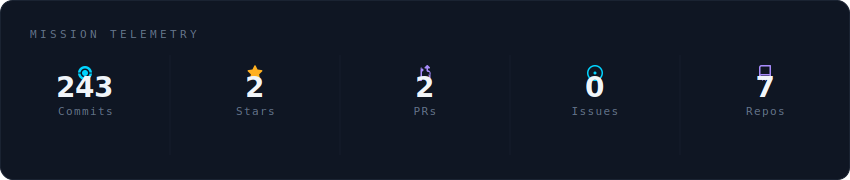

##

  

 

  

 

  

 

##

Sobre mim

 

Tenho 21 anos, moro em São Paulo e estou no último ano de Análise e Desenvolvimento de Sistemas pela Fatec.
Atuo profissionalmente desde 2024 com tecnologias modernas como Next.js, NestJS, TypeScript, Prisma e Docker.

No meu tempo livre e deslocamentos, continuo estudando e aprimorando minhas habilidades por meio de cursos, artigos e projetos próprios.

Projeto de destaque: Desenvolvi sozinho um sistema real completo que está em uso em um condomínio de alto padrão localizado em Itu-SP, automatizando a geração de notificações de veículos que ultrapassavam a velocidade em radares internos. 
O sistema integrou APIs dos radares, IA para anonimização de imagens, dashboard interativo, relatórios, exportação PDF/Excel, envio automático de e-mails, Whatsapp.
O processo, antes manual e demorado (13 a 15 minutos por notificação), passou a ser 100% automatizado — eliminando erros, necessidade de contratação de uma pessoa somente para este serviço e economizando dezenas de horas mensais.

Stack principal:
Front-end: Next.js, TypeScript, CSS Modules / Styled Components
Back-end: NestJS, Prisma, Docker, MySQL
Outros: APIs REST, Scrum, AWS (básico), Git e CI/CD

Soft skills: Comunicação assertiva, proatividade, foco em qualidade, aprendizado rápido e colaboração em equipe.

Tenho inglês intermediário com prática recorrente em conversas com nativos e grupos de estudo internacionais. Tenho inclusive conteúdos no meu canal do YouTube (LottusDev) com discussões em inglês sobre programação com pessoas de outros países.

##

### 🌟 Principais Habilidades:
##

  
  
  
  
  
  
  
  

  

##

###    Meu canal no youtube: <a href="https://www.youtube.com/@LottusDev" target="_blank">https://www.youtube.com/@LottusDev</a> 

