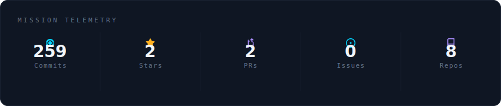

##

  

 

  

 

  

 

##

Sobre mim

 

Tenho 21 anos, moro em São Paulo e estou no último semestre de Análise e Desenvolvimento de Sistemas pela Fatec.
Atuo profissionalmente desde o final de 2024 com tecnologias como Next.js, NestJS, TypeScript, Prisma e Docker.

Projeto de destaque: Desenvolvi individualmente um sistema web full stack atualmente em uso diário por condomínios, responsável por automatizar integralmente o processamento de infrações de velocidade registradas por radares internos.
A solução integrou APIs dos equipamentos para captura automática dos eventos, implementou anonimização de imagens com uso de IA, estruturou dashboards administrativos interativos, geração de relatórios gerenciais, exportação de dados em PDF e Excel e envio automatizado de notificações por e-mail e WhatsApp. O ambiente foi containerizado com Docker e estruturado em nuvem, garantindo estabilidade, padronização de deploy e escalabilidade. A arquitetura foi projetada no modelo multi-tenant, permitindo múltiplos clientes operando em uma única instância de aplicação e banco de dados com isolamento lógico por tenant, reduzindo custos de infraestrutura, simplificando manutenção e viabilizando escalabilidade comercial sem aumento proporcional de despesas técnicas. 
O processo, que anteriormente era manual e levava entre 13 e 15 minutos por notificação, passou a ser 100% automatizado, com tempo médio de aproximadamente 5 segundos por ocorrência, eliminando falhas operacionais, removendo a necessidade de contratação dedicada para a atividade e economizando dezenas de horas mensais de trabalho. Além do ganho operacional, o sistema elevou a percepção de valor do serviço oferecido aos clientes, aumentou a capacidade de processamento da empresa e abriu espaço para expansão da base de condomínios atendidos sem necessidade de ampliação da equipe e sem crescimento proporcional de despesas, gerando impacto direto na eficiência, competitividade e potencial de receita do negócio.

Principais habilidades técnicas:
Backend: NestJS, Node.js, TypeScript, Prisma, MySQL, APIs REST
Frontend: Next.js, React, TypeScript, CSS Modules / Styled Components
Banco de Dados: Modelagem relacional 
DevOps: Docker, containerização
Testes: Jest
Controle de Versão: Git, GitHub
Arquitetura: Multi-tenant, APIs escaláveis, separação de camadas
Metodologias Ágeis: Scrum, Kanban

Tenho inglês intermediário com prática recorrente em conversas com nativos e grupos de estudo internacionais. Tenho inclusive conteúdos no meu canal do YouTube (LottusDev) com discussões em inglês sobre programação com pessoas de outros países.

##

### 🌟 Principais Habilidades:
##

  
  
  
  
  
  
  
  

  

##

###    Meu canal no youtube: <a href="https://www.youtube.com/@LottusDev" target="_blank">https://www.youtube.com/@LottusDev</a> 

