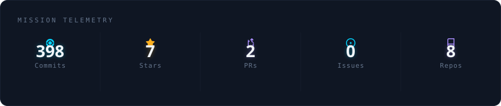

##

  

 

  

 

  

 

##

<h3>Sobre mim</h3>

 

Tenho 21 anos, formado em Análise e Desenvolvimento de Sistemas pela Fatec e hoje atuo profissionalmente como desenvolvedor full stack desde o final de 2024, mas iniciei os estudos de programação em 2023.

Projeto de destaque: Desenvolvi sozinho um sistema que atualmente está em uso diário por mais de 14 condomínios, responsável por automatizar integralmente o processamento de infrações de velocidade registradas por radares internos.

A solução integrou APIs dos equipamentos para captura automática dos eventos, implementou anonimização de imagens com uso de IA, estruturou dashboards administrativos interativos, geração de relatórios gerenciais, exportação de dados, envio automatizado de notificações por e-mail e WhatsApp, e etc. O ambiente foi containerizado com Docker e estruturado em nuvem com uma pipeline de CI/CD, garantindo estabilidade, padronização de deploy e escalabilidade. A arquitetura foi projetada no modelo multi-tenant, permitindo múltiplos clientes operando em uma única instância de aplicação e banco de dados com isolamento lógico, reduzindo custos de infraestrutura, simplificando manutenção e viabilizando escalabilidade comercial sem aumento proporcional de despesas técnicas.
O processo, que anteriormente era manual e levava entre 13 e 15 minutos por notificação, passou a ser 100% automatizado, com tempo médio de aproximadamente 5 segundos por ocorrência, eliminando falhas operacionais, removendo a necessidade de contratação de funcionário dedicado somente para a atividade e também economizando dezenas de horas mensais de trabalho. Além do ganho operacional, o sistema elevou a percepção de valor do serviço oferecido aos clientes, aumentou a capacidade de processamento da empresa e abriu espaço para expansão da base de condomínios atendidos sem necessidade de ampliação da equipe e sem crescimento proporcional de despesas, gerando impacto direto na eficiência, competitividade e potencial de receita do negócio.

Sem detalhar, mas outro projeto de destaque que desenvolvi sozinho foi um sistema que está em uso real por uma faculdade estadual (Fatec), onde iniciou como um tcc de uma plataforma de gestão de eventos acadêmicos, mas foi solicitada, aprovada e adotada pela Fatec Itu como sistema oficial para organização de eventos, onde hoje em dia os alunos e colaboradores utilizam dentro da instituição.

Tenho inglês avançado com prática recorrente em conversas com nativos e grupos internacionais. Tenho inclusive conteúdos no meu canal do YouTube (LottusDev) com discussões em inglês sobre programação e outros assuntos com pessoas de outros países

##

### 🌟 Principais Habilidades:
##

  
  
  
  
  
  
  
  

  

##

###    Meu canal no youtube: <a href="https://www.youtube.com/@LottusDev" target="_blank">https://www.youtube.com/@LottusDev</a> 

