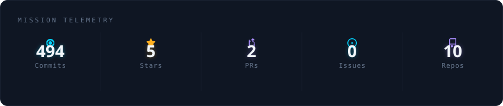

**Full Stack Developer | CEO da [Lottus Labs](https://lottus-labs.vercel.app)**

##

  

 

  

 

  

##

<h3>👨‍💻 Sobre mim</h3>

 

Sou **Guilherme Pereira**, desenvolvedor Full Stack e **CEO da [Lottus Labs](https://lottus-labs.vercel.app)**, empresa voltada ao desenvolvimento de soluções tecnológicas.

Sou graduado em **Análise e Desenvolvimento de Sistemas pela Fatec** e atuo profissionalmente como desenvolvedor desde o final de 2024, tendo iniciado meus estudos em programação em 2023.

Minha experiência envolve o desenvolvimento de aplicações de ponta a ponta, desde arquitetura de software, modelagem de dados e construção de APIs até interfaces, integrações externas, automações, infraestrutura e implantação em produção.

Tenho foco especial em **soluções que resolvem problemas reais**, automatizam processos e geram resultados mensuráveis para empresas e instituições.

### 🚀 Projetos de destaque

#### 🚗 Plataforma de Gestão e Automação de Infrações de Velocidade

**Sistema Multi-Tenant | Produção Comercial | Desenvolvimento Individual**

Desenvolvi individualmente uma plataforma utilizada diariamente por **mais de 14 condomínios**, responsável por automatizar integralmente o processamento de infrações de velocidade registradas por radares internos.

A solução inclui:

- **Integração com APIs de radares** para captura automática de eventos e ocorrências.
- **Anonimização de imagens utilizando Inteligência Artificial**, preservando informações sensíveis.
- **Dashboards administrativos interativos**, indicadores operacionais e relatórios gerenciais.
- **Exportação de dados** e gerenciamento das ocorrências.
- **Notificações automatizadas** por e-mail e WhatsApp.
- **Arquitetura multi-tenant**, permitindo múltiplos clientes em uma única aplicação e banco de dados, com isolamento lógico de dados.
- **Docker, infraestrutura em nuvem e CI/CD**, garantindo padronização dos deploys e facilitando manutenção e expansão.

**📊 Impacto gerado:**

| Indicador | Resultado |
|:---|:---|
| Clientes atendidos | 14+ condomínios |
| Processamento anterior | 13–15 minutos por notificação |
| Processamento automatizado | Aproximadamente 5 segundos |
| Automação do processo | 100% |
| Ganho operacional | Dezenas de horas economizadas mensalmente |

A implementação eliminou tarefas manuais repetitivas, reduziu falhas operacionais e removeu a necessidade de contratação de um funcionário dedicado exclusivamente a essa atividade.

Além disso, a arquitetura possibilitou expandir a operação sem necessidade de crescimento proporcional da equipe ou dos custos de infraestrutura, aumentando a eficiência, a capacidade de atendimento e o potencial comercial do negócio.

Todo o ciclo de desenvolvimento, incluindo **arquitetura, backend, frontend, integrações, banco de dados, infraestrutura e deploy**, foi realizado individualmente por mim.

🔗 Saiba mais sobre o projeto: [Rumo Radares - GitHub](https://github.com/GuilhermeFranciscoPereira/RumoRadares_Pinguim)

---

#### 🎓 Plataforma de Gestão de Eventos Acadêmicos — Fatec Itu

**Sistema Institucional | Produção Real | Desenvolvimento Individual**

Outro projeto que desenvolvi individualmente foi uma plataforma de gestão de eventos acadêmicos, inicialmente criada como meu **Trabalho de Conclusão de Curso (TCC)**.

O projeto ultrapassou o ambiente acadêmico: a solução foi **solicitada, aprovada e adotada oficialmente pela Fatec Itu**, tornando-se um sistema utilizado por alunos e colaboradores da instituição.

A plataforma digitaliza e centraliza processos relacionados à organização e ao gerenciamento de eventos acadêmicos.

Esse projeto representa a evolução de uma solução acadêmica para um **software institucional em produção**, desenvolvido para atender necessidades reais de uma instituição pública de ensino superior.

Fui responsável pelo desenvolvimento integral do **Front-end e Back-end** da plataforma. Porém, a versão **mobile** foi desenvolvida pelo meu grande amigo e desenvolvedor **[José Lucas](https://github.com/JoseMGomes)**, cujo trabalho está disponível no repositório: **[App Eventos Fatec - GitHub](https://github.com/JoseMGomes/app-eventos-fatec)**.

🔗 Saiba mais sobre o projeto: [Eventos Fatec Itu - GitHub](https://github.com/GuilhermeFranciscoPereira/Eventos_Fatec_Itu-Back-End)

---

### 🧠 Áreas de atuação e interesse

- **Frontend:** desenvolvimento de interfaces modernas, responsivas e interativas.
- **Backend:** construção de APIs, integrações e regras de negócio.
- **Arquitetura:** aplicações multi-tenant, organização de sistemas e escalabilidade.
- **Automação:** otimização de processos e integração entre plataformas.
- **DevOps:** Docker, CI/CD, deploy e manutenção de aplicações em nuvem.
- **Inteligência Artificial:** integração de recursos de IA em soluções de software.

##

### 🌎 Idiomas

Tenho **inglês avançado**, com prática recorrente em conversas com nativos e participação em comunidades internacionais.

Também produzo conteúdos no meu canal **[LottusDev](https://www.youtube.com/@LottusDev)**, incluindo discussões em inglês sobre programação, tecnologia e outros assuntos com pessoas de diferentes países.

##

### 🛠️ Principais Tecnologias & Competências

 

`CI/CD` • `Multi-Tenant` • `Cloud` • `Automação` • `APIs & Integrações` • `IA`

##

### 🎥 Meu canal no YouTube — LottusDev

Compartilho conteúdos, experiências e discussões sobre programação, desenvolvimento de software e tecnologia, incluindo conversas em inglês com desenvolvedores e pessoas de outros países.

